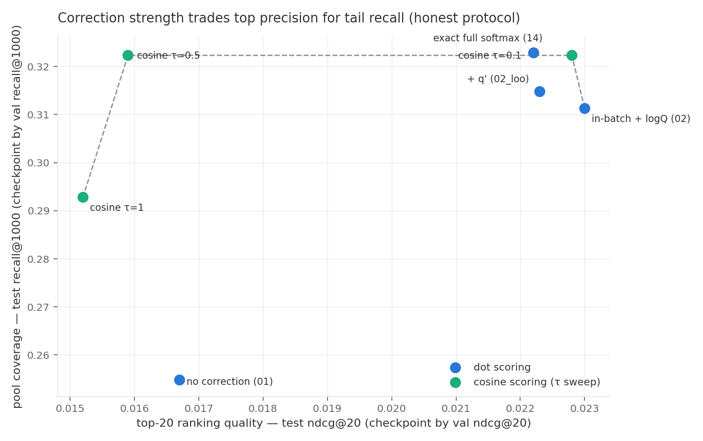
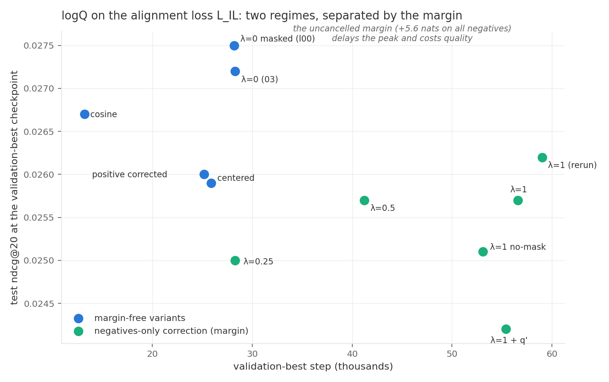

# Experiment results: logQ correction study on MCLSR (Amazon Clothing)

**Protocol.** The checkpoint is selected by the *validation* metric and the test
metric is reported **at that checkpoint** (metric-matched selection: ndcg tables
select by validation ndcg@20, the recall@1000 table selects by validation
recall@1000). Single seed 42, same GPU node, full-catalog ranking over disjoint
test users (transductive user split 8:1:1, as in the MCLSR paper), standard NDCG
normalization (`comirec-ndcg` is logged for comparison with the paper's tables).
Run-to-run noise: **±0.001** ndcg@20 / **±0.005** recall@1000 — differences within
it are ties. Single-seed numbers; the headline table will be re-run with 3 seeds.

*(2026-07-14: all test columns recomputed under this protocol after an external
audit correctly noted that the previous revision reported best-over-training test
values; conclusions that changed are marked.)*

## 1. Retrieval loss (L_P): the correction works and matches the exact softmax

| config | val | test | note |
|---|---|---|---|
| 01 in-batch, no correction | 0.0168 | 0.0167 | biased baseline |
| **02 in-batch + logQ** | 0.0245 | **0.0230** | **+38%** |
| 02 + leave-own-out q' | 0.0253 | 0.0223 | = 02 (q' is a ≤1.6e-3 row constant here) |
| **14 exact full softmax** (no sampling) | 0.0246 | 0.0222 | gold standard |

**In-batch + logQ is statistically indistinguishable from the exact full softmax**
(0.0230 vs 0.0222, within noise) — the correction recovers everything sampling
takes away at top-20.

Same effect on a second architecture (SASRec, only λ changes):

| config | val | test |
|---|---|---|
| SASRec BCE baseline | 0.0138 | 0.0108 |
| SASRec in-batch, λ=0 | 0.0110 | 0.0085 |
| **SASRec in-batch, λ=1** | **0.0208** | **0.0155** |

Cosine scoring on the retrieval loss (with logQ) survives at τ=0.1 (test 0.0228 ≈
dot) and collapses once the score scale drops further below the fixed correction:
τ=0.5 → 0.0159, τ=1 → 0.0152. Keep dot products (or cosine with a small τ).

## 2. Interest-level contrastive L_IL: the correction hurts — anatomy of why

Base = 03 (graph + L_IL + downstream logQ). λ sweep shows a dose response; every
"distribution fix" changes nothing; removing the *margin* restores the training
dynamics and the validation peak.

| L_IL variant | val | test | val-best step |
|---|---|---|---|
| **03: no correction (λ=0)** | 0.0276 | **0.0272** | ~28k |
| 04_l00 (fps_logq λ=0, masked) | 0.0276 | 0.0275 | ~28k |
| 04 λ=0.25 | 0.0270 | 0.0250 | ~28k |
| 04 λ=0.5 | 0.0267 | 0.0257 | ~41k |
| 04 λ=1 (two runs) | 0.0264 / 0.0269 | 0.0257 / 0.0262 | **~57–59k** |
| 04 λ=1 + leave-own-out q' | 0.0255 | 0.0242 | ~55k |
| 04 λ=1, no masking | 0.0269 | 0.0251 | ~53k |
| 04 λ=1 **centered** (margin removed) | **0.0286** | 0.0259 | **~26k** |
| 04 λ=1 **positive also corrected** | **0.0289** | 0.0260 | ~25k |
| 04 λ=1 + **cosine** similarity | **0.0295** | 0.0267 | ~13k |

Mechanism: with the negatives-only convention the common part of the correction
(~5.6 nats, vs ±0.4 of actual per-user reweighting) becomes an uncancelled margin.
Under unbounded dot scores the model fights it by inflating norms → slow rise, late
peak, quality loss. Removing the margin (centering ≡ correcting the positive) or
bounding the scores (cosine) each independently restores the early peak and lifts
validation *above* the λ=0 base (0.0286–0.0295 vs 0.0276), while single-seed test
values recover only partially (0.0259–0.0267 vs 0.0272) — seeds needed to settle
the test-side comparison. Either way, no corrected variant beats "no correction":
**alignment losses have no corpus-target distribution to debias.**

Sanity variants: shared L_IL projection head (paper eq. 7) — equal on validation
(0.0279 vs 0.0276), lower on single-seed test (0.0255 vs 0.0272): unresolved at
one seed. B×B cross-view scheme: **inconclusive** — the current B×B run also
doubled the effective L_IL weight (the symmetric loss divides by 2), so scheme and
weight are confounded; a weight-matched rerun is queued. Cosine similarity
(paper eq. 8) = dot on quality (0.0267–0.0275), 2× faster convergence.

## 3. Feature-level contrastive L_UC / L_IC

Isolated pairs (downstream logQ + one feature branch), plus an **exact full-softmax
anchor**: batch anchors scored against ALL users/items (no sampling at all).

| variant | val | test |
|---|---|---|
| 09 L_IC λ=0 | 0.0244 | 0.0216 |
| 10 L_IC λ=1 | 0.0243 | 0.0231 |
| 09/10 under cosine | 0.0235 / 0.0243 | 0.0220 / 0.0220 |
| **16 L_IC exact full softmax** | 0.0239 | 0.0224 |
| 11 L_UC λ=0 | 0.0243 | 0.0211 |
| 12 L_UC λ=1 + q' | 0.0242 | 0.0224 |
| 13 L_UC λ=1, no masking | 0.0230 | 0.0216 |
| **15 L_UC exact full softmax** | 0.0236 | 0.0212 |

The exact full softmax matches the in-batch versions on both branches — in-batch
sampling loses nothing here. Under the honest protocol logQ shows a small
*positive* test effect on both branches (+0.0013–0.0015, ≈1.5 noise units,
single seed): harmless-to-mildly-useful, consistent with the tail-recall gains in
section 6.

## 4. Full model

| config | val | test |
|---|---|---|
| 05 graph + all contrastive, no logQ on them | 0.0273 | 0.0266 |
| 06 + logQ on L_UC/L_IC | 0.0288 | 0.0257 |
| 07 + logQ on everything | 0.0276 | 0.0246 |

Best overall recipe remains the **03 family: graph + logQ on the retrieval loss
only** (test 0.0272; the cosine variant 0.0275 with 2× faster convergence).

## 5. Reproducibility

Same node + same seed reproduces to 4 decimals (03 rerun exact). Concurrent twins
with `deterministic: true` still diverge from step ~130 (graph CUDA ops have no
deterministic implementation) up to ~0.001 ndcg@20 — hence the noise floor above,
paired arms always run on one node, and final tables will use 3 seeds.

## The recipe

| loss type | correction |
|---|---|
| retrieval (sampled/in-batch softmax over a catalog) | logQ on **negatives only**; leave-own-out q' only matters when one id holds a visible share of the data |
| contrastive alignment (SimCLR-style views) | **no correction needed for top-k quality**; a margin-free form (centered / positive-corrected) or cosine scoring avoids the harm; small tail-recall gains are possible (§6) |

## 6. The candidate-generation view: recall@1000

Checkpoints here are selected by **validation recall@1000** (the deployment-relevant
choice for a candidate generator). Test recall@1000 at that checkpoint:

| retrieval variant | test recall@1000 |
|---|---|
| 01 in-batch, no correction | 0.2548 |
| 02 in-batch + logQ | 0.3113 (+22%) |
| 02 + q' | 0.3148 |
| **14 exact full softmax** | **0.3229** |
| 02 cosine τ=0.1 | 0.3223 |
| 02 cosine τ=0.5 | 0.3223 |
| 02 cosine τ=1 | 0.2928 |

| graph / contrastive variant | test recall@1000 |
|---|---|
| 03 (logQ downstream only) | 0.3583 |
| 04 λ=1 on L_IL (two runs) | 0.3520 / 0.3467 |
| 04 centered / positive-corrected | 0.3568 / 0.3580 |
| 03 shared projector | 0.3626 |
| 05 full model, no logQ on contrastive | 0.3612 |
| 06 + logQ on L_UC/L_IC | 0.3618 |
| 09 → 10 (L_IC λ=0 → λ=1) | 0.3076 → **0.3167** |

Takeaways:
- the core story holds at @1000: the correction is the single biggest win, and
  logQ on L_IL still does not beat no-correction;
- at recall@1000 the exact full softmax keeps a small edge over in-batch+logQ
  (0.3229 vs 0.3113, ~+3.7%, above noise) — the correction closes most but not
  all of the tail gap; cosine retrieval variants (τ=0.1/0.5) reach the same
  0.322 level while costing top-20 precision (τ=0.5 pays 0.0159 at @20);
- logQ on L_IC buys tail recall (+0.009) at no top-20 cost — on contrastive
  losses the correction acts as a mild tail/head dial rather than a pure harm.
