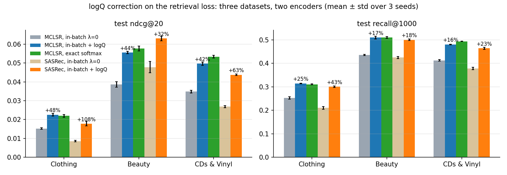
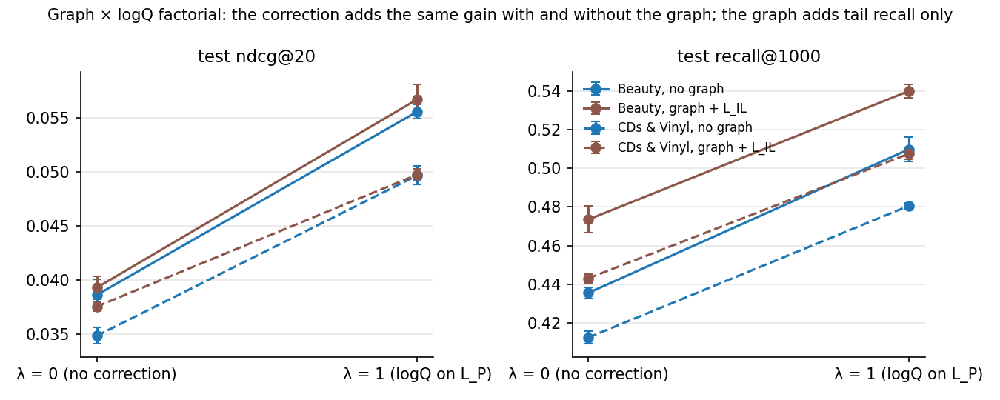
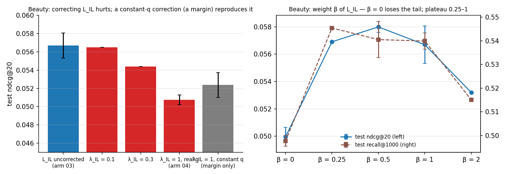
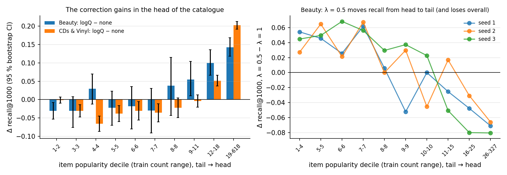
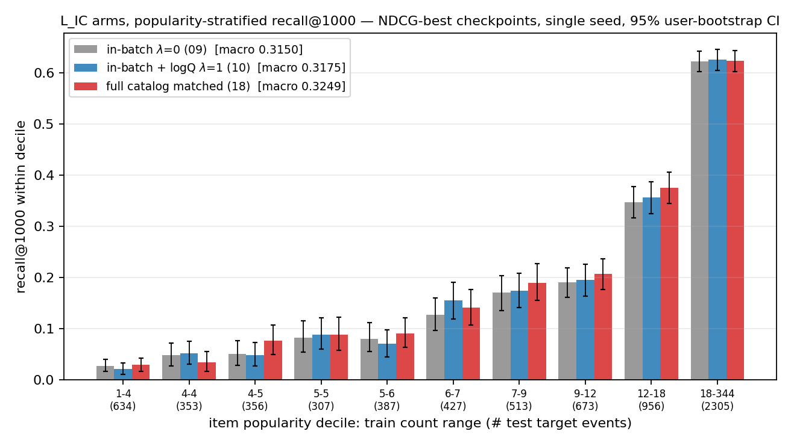

# Experiment results: logQ correction study on MCLSR

Two parts. **Part A** (September 2026) is the multi-seed study across three datasets
under one protocol; it supersedes the single-seed numbers below wherever they overlap.
**Part B** is the original single-seed exploratory study on Amazon Clothing (July–August
2026), kept as the record of how the hypotheses were formed. Every run with its numbers: `RUN_INDEX.md`.

## Part A. Multi-seed results across three datasets (September 2026)

**Protocol.** `scripts/train_confirmatory.py`: the test callback is removed before
training; one checkpoint is kept per validation metric (ndcg@20 and recall@1000) and
written atomically on every improvement; the test set is evaluated **once** per
arm × seed × metric on the selected checkpoint; shared no-progress patience of 10
epochs, hard cap of 250 000 steps; validation every 64 steps. Reports carry sha256 of
the config, count tables and checkpoints (`results/confirm/*.json`). Seeds 1, 2, 3;
tables show the mean, per-seed values are in `RUN_INDEX.md`. The CDs & Vinyl runs followed a plan written down before the first run (7 arms,
seeds 1–3, hypotheses and decision rules). Seed-to-seed std: 0.0004–0.0019 ndcg@20, 0.001–0.008
recall@1000; single-run differences below ~0.002 ndcg@20 are not interpreted.
Two runs of one seed with deterministic flags give bit-identical weights for the
no-graph configurations; graph configurations drift by ~1e-6 in the loss even with the
flags (sparse CUDA kernels), and without the flags the same seed drifts by ±0.0005 ndcg@20.

### A.1 Headline table (test ndcg@20 / recall@1000, mean of 3 seeds)

| arm | Clothing (39k users / 23k items, Gini 0.42) | Beauty (22k / 12k, Gini 0.50) | CDs & Vinyl "Toys" (75k / 64k, Gini 0.54) |
|---|---|---|---|
| MostPop (no training) | — | 0.0118 / 0.317 | — |
| 01 MCLSR w/o graph, in-batch, λ=0 | 0.0152 / 0.252 | 0.0386 / 0.436 | 0.0349 / 0.413 |
| **02 + logQ on L_P** | **0.0226 / 0.314** | **0.0556 / 0.510** | **0.0497 / 0.481** |
| 14 exact full softmax (no sampling) | 0.0219 / 0.311 | 0.0577 / 0.510 | 0.0534 / 0.494 |
| 03 graph + L_IL (full model, logQ on L_P) | 0.0261 / 0.358 | 0.0567 / 0.540 | 0.0497 / 0.508 |
| 04 graph, logQ also on L_IL | 0.0249 / 0.344 | 0.0508 / 0.529 | 0.0489 / 0.505 |
| graph, no correction (λ=0) | — | 0.0393 / 0.474 | 0.0376 / 0.443 |
| SASRec in-batch, λ=0 | 0.0085 / 0.211 | 0.0478 / 0.425 | 0.0268 / 0.378 |
| SASRec in-batch, λ=1 | 0.0178 / 0.300 | 0.0631 / 0.500 | 0.0438 / 0.464 |

- **Retrieval correction (01→02):** +48 % / +44 % / +42 % ndcg@20 and +25 % / +17 % / +16 %
  recall@1000; the paired per-seed difference is positive on every seed of every dataset
  (Beauty user-level paired bootstrap CI [+0.0135, +0.0219]). Same on SASRec:
  +108 % / +32 % / +63 %.
- **Exact softmax anchor:** in-batch + logQ recovers (02−01)/(14−01) = ≥100 % (Clothing,
  the two are equal), 89 % (Beauty), 80 % (Toys) of the exact-softmax gain; the remainder
  (+0.002 Beauty, +0.004 Toys) is positive on every seed and grows with the catalogue.
  Exact softmax costs nothing extra at these catalogue sizes (23.7 steps/s for both on
  Beauty), so this is a statement about accuracy, not speed.

- **Graph × logQ factorial (Beauty, Toys):** the correction adds +0.0169 / +0.0174 (Beauty)
  and +0.0148 / +0.0122 (Toys) without / with the graph — additive; the graph alone does
  not fix the popularity bias (+0.0007 / +0.0027 ndcg@20) and adds tail recall only
  (+0.03…+0.04).
- **Correction on the alignment loss L_IL (03→04) hurts, dataset-dependently:**
  −0.0059 / −0.011 on Beauty (every seed, CI [−0.0083, −0.0020]), −0.0012 / −0.014 on
  Clothing (tail on every seed), −0.0008 / −0.002 on Toys (sign on 3/3 seeds, size within
  noise). Peaks arrive ~2× later (Beauty epoch 47–49 vs 19–25).

### A.2 Mechanism and sensitivity (Beauty, 3 seeds unless marked †)

| question | arms | test ndcg@20 / recall@1000 | verdict |
|---|---|---|---|
| Is the L_IL harm a margin effect? | 04 with a **constant** user-count table (pure margin, no popularity information) | 0.0524 / 0.528 vs 03 0.0567 / 0.540 vs 04 0.0508 / 0.529 | yes: the constant reproduces ¾ of the harm on every seed and the late peak; λ_IL = 0.1 / 0.3 / 1 → 0.0565 / 0.0544 / 0.0508 † (monotone dose); on CDs & Vinyl (3 seeds) constant q = real q (0.0489 = 0.0489) where the harm itself is small (−0.0008) |
| Is L_IL needed at all? | β = 0 | 0.0500 / 0.498 | yes: worse than the full model (−0.0067 / −0.042, every seed) and even than the model without the graph — the graph's tail gain reaches I_s only through L_IL (inference uses I_s) |
| Weight of L_IL | β = 0.25 † / 0.5 / 1 / 2 † | 0.0569 / 0.0580 / 0.0567 / 0.0532 | plateau 0.25–1 (β = 0.5: +0.0014 on validation on every seed, +0.0013 test, tail equal); β = 2 hurts; the paper's β = 1 is kept |
| Interest mix α | 0.25 / 0.5 / 0.75 / 0.9 † | 0.0543 / 0.0567 / 0.0579 / 0.0585 | plateau 0.5–0.9 on validation; α = 0.5 kept |
| Feature-level weight γ | 0.05 / 0.1 / 0.2 † / 0.5 | 0.0563 / 0.0565 / 0.0557 / 0.0563 | no effect (γ = 0.5 below base on validation) |
| Form of the correction | negatives-only (ours) / standard (Yi et al.) / corrected (Khrylchenko, Baikalov et al., RecSys'25) | 0.0556 / 0.0558 / 0.0546; SASRec 0.0631 / — / 0.0632 | equal within noise, both encoders |
| Mixed negatives (MNS, +128 uniform) † | three forms | 0.0572 / 0.0546 / 0.0560 | = in-batch + logQ |
| Explicit negatives † | uniform 127 / 1280; popular 127; popular + logQ | 0.0491 / 0.0537; 0.0407; 0.0497 | all below in-batch + logQ (tail −0.02) |
| Batch size † | 128 / 256 / 512 | 01: 0.0380 / 0.0374 / 0.0390; 02: 0.0555 / 0.0554 / 0.0559 | the gain (~45 %) does not depend on the number of negatives |
| λ on L_P | 0.5 vs 1 | 0.0513 / 0.487 vs 0.0556 / 0.510 | λ = 1 dominates on every seed; λ < 1 only reshapes the popularity profile (tail decile +0.03…+0.05, head −0.07…−0.08, significant on every seed) |
| Remedies for L_IL † | centred log q; cosine τ 0.1/0.5/1; euclid τ 0.5/1/2 (± logQ) | 0.0564; 0.0569/0.0577/0.0547; 0.0589/0.0574/0.0599 (logQ: 0.0563/0.0550/0.0540) | remove the harm, never beat the uncorrected base; euclid + logQ worse at every τ |
| Learned loss weights † | Kendall et al. uncertainty weighting | 0.0437 | weights drift to the likelihood optimum, not the ranking one |
| Implementation details † | shared L_IL projector; paper-faithful (shared projector + cosine + paper scheme) | 0.0565; 0.0569 | no difference to 03 |

### A.3 Component ablation (Beauty, 3 seeds; logQ on L_P throughout)

| arm | user–item graph | L_IL | user–user graph (L_UC) | item–item graph (L_IC) | test ndcg@20 | recall@1000 |
|---|---|---|---|---|---|---|
| 02 no graphs | – | – | – | – | 0.0556 | 0.510 |
| 03 | + | + | – | – | 0.0567 | 0.540 |
| 05 full model of the paper | + | + | + | + | 0.0573 | 0.539 |
| 05 − user–user | + | + | – | + | 0.0565 | 0.535 |
| 05 − item–item | + | + | + | – | 0.0570 | 0.541 |
| 05 − L_IL | + | – | + | + | 0.0516 | 0.490 |
| 03 − L_IL (β = 0) | + | – | – | – | 0.0500 | 0.498 |

The user–user and item–item graphs and their feature-level contrastive losses contribute nothing (every paired difference within noise), on CDs & Vinyl as well (3 seeds: full model 0.0494 / 0.506, minus user–user 0.0494 / 0.505, minus item–item 0.0488 / 0.505, vs 0.0497 / 0.508 without them). Removing the alignment loss L_IL costs −0.0057 / −0.049 on every seed even with both feature graphs in place (CDs & Vinyl, 3 seeds: 0.0404 / 0.449, and 0.0390 / 0.445 for the graph alone — below the model without any graph): the only working component of the graph branch is the user–item graph aligned to the sequential interest through L_IL, and its contribution is tail recall.

Independent replication: `scripts/indep_check_beauty.py` (no `irec` code — own data
loading, encoder, loss and metrics) gives 0.0411 / 0.408 → 0.0619 / 0.524 on Beauty
(+51 % / +29 %). Data checks (`scripts/check_split_leakage.py`): train/valid/test users
are disjoint; count tables and graphs are reconstructed exactly from the train files.

## Part B. Clothing exploratory study (July–August 2026, single seed)

**Protocol.** The checkpoint is selected by the *validation* metric and the test
metric is taken from the **nearest logged test evaluation to that step** (test is
evaluated every 256 steps, validation every 64 — so reported test values are an
approximation within ±128 steps of the selected checkpoint). Selection is
metric-matched: ndcg tables select by validation ndcg@20, the recall@1000 table by
validation recall@1000. Because the test set was evaluated periodically throughout
this study, all Clothing numbers are **exploratory**; confirmatory numbers will
come from a pre-registered protocol (fixed configs, 3 seeds, test opened once) on
a second dataset. Single seed 42, same GPU node, full-catalog ranking over disjoint
test users (transductive user split 8:1:1, as in the MCLSR paper), standard NDCG
normalization (`comirec-ndcg` is logged for comparison with the paper's tables).
Run-to-run noise: **±0.001** ndcg@20 from concurrent same-node twins; for
recall@1000 a same-seed rerun on another node moved an arm by +0.011 (§5), so
recall@1000 differences below **~±0.01** are treated as unresolved ties.
Single-seed numbers; the headline table will be re-run with 3 seeds.

## 1. Retrieval loss (L_P): the correction works and matches the exact softmax

| config | val | test | note |
|---|---|---|---|
| 01 in-batch, no correction | 0.0168 | 0.0167 | biased baseline |
| **02 in-batch + logQ** | 0.0245 | **0.0230** | **+38%** |
| 02 + leave-own-out q' | 0.0253 | 0.0223 | = 02 (q' is a ≤1.6e-3 row constant here) |
| **14 exact full softmax** (no sampling) | 0.0246 | 0.0222 | gold standard |

**In-batch + logQ lands within the observed same-seed variation of the exact full
softmax** (0.0230 vs 0.0222; single seed, multi-seed confirmation pending) — no
material top-20 gap to the gold standard was observed.

Same effect on a second architecture (SASRec, only λ changes):

| config | val | test |
|---|---|---|
| SASRec BCE baseline | 0.0138 | 0.0108 |
| SASRec in-batch, λ=0 | 0.0110 | 0.0085 |
| **SASRec in-batch, λ=1** | **0.0208** | **0.0155** |

Cosine scoring on the retrieval loss (with logQ) survives at τ=0.1 (test 0.0228 ≈
dot) and collapses once the score scale drops further below the fixed correction:
τ=0.5 → 0.0159, τ=1 → 0.0152. Keep dot products (or cosine with a small τ).

## 2. Interest-level contrastive L_IL: the correction hurts — anatomy of why

Base = 03 (graph + L_IL + downstream logQ). λ sweep shows a dose response; every
"distribution fix" changes nothing; removing the *margin* restores the training
dynamics and the validation peak.

| L_IL variant | val | test | val-best step |
|---|---|---|---|
| **03: no correction (λ=0)** | 0.0276 | **0.0272** | ~28k |
| 04_l00 (fps_logq λ=0, masked) | 0.0276 | 0.0275 | ~28k |
| 04 λ=0.25 | 0.0270 | 0.0250 | ~28k |
| 04 λ=0.5 | 0.0267 | 0.0257 | ~41k |
| 04 λ=1 (two runs) | 0.0264 / 0.0269 | 0.0257 / 0.0262 | **~57–59k** |
| 04 λ=1 + leave-own-out q' | 0.0255 | 0.0242 | ~55k |
| 04 λ=1, no masking | 0.0269 | 0.0251 | ~53k |
| 04 λ=1 **centered** (margin removed) | **0.0286** | 0.0259 | **~26k** |
| 04 λ=1 **positive also corrected** | **0.0289** | 0.0260 | ~25k |
| 04 λ=1 + **cosine** similarity | **0.0295** | 0.0267 | ~13k |

Mechanism: with the negatives-only convention the common part of the correction
(~5.6 nats, vs ±0.4 of actual per-user reweighting) becomes an uncancelled margin.
Under unbounded dot scores the model fights it by inflating norms → slow rise, late
peak, quality loss. Removing the margin (centering ≡ correcting the positive) or
bounding the scores (cosine) each independently restores the early peak and lifts
validation *above* the λ=0 base (0.0286–0.0295 vs 0.0276), while single-seed test
values recover only partially (0.0259–0.0267 vs 0.0272) — seeds needed to settle
the test-side comparison. Either way, no corrected variant beats "no correction":
**alignment losses have no corpus-target distribution to debias.**

Sanity variants: shared L_IL projection head (paper eq. 7) — equal on validation
(0.0279 vs 0.0276), lower on single-seed test (0.0255 vs 0.0272): unresolved at
one seed. **B×B cross-view scheme, weight-matched: val 0.0286 / test 0.0285 — the
best single run in the study** (suggestive, single seed; the unmatched-weight B×B
run scored 0.0283/0.0251 and is kept as a loss-weight robustness point). A
paper-eq.-8 run (B×(2B−1), sequential-anchored) is paired against B×B to isolate
exactly the one-vs-two-negatives-per-user factor. Cosine similarity (paper eq. 8)
= dot on quality (0.0267–0.0275), 2× faster convergence.

Note on q': on this seed the q'-corrected λ=1 run scored below plain λ=1
(0.0242 vs 0.0257/0.0262) — q' does not rescue the drop and shows no benefit;
"no-op" is confirmed only for the downstream loss (02_loo ≈ 02).

## 3. Feature-level contrastive L_UC / L_IC

Isolated pairs (downstream logQ + one feature branch), plus an **exact full-softmax
anchor**: batch anchors scored against ALL users/items (no sampling at all).

| variant | val | test |
|---|---|---|
| 09 L_IC λ=0 | 0.0244 | 0.0216 |
| 10 L_IC λ=1 | 0.0243 | 0.0231 |
| 09/10 under cosine | 0.0235 / 0.0243 | 0.0220 / 0.0220 |
| **16 L_IC exact full softmax** | 0.0239 | 0.0224 |
| 11 L_UC λ=0 | 0.0243 | 0.0211 |
| 12 L_UC λ=1 + q' | 0.0242 | 0.0224 |
| 13 L_UC λ=1, no masking | 0.0230 | 0.0216 |
| **15 L_UC exact full softmax** | 0.0236 | 0.0212 |

Configs 15/16 are **preliminary cross-view full-catalog anchors**, not exact
counterparts of the in-batch losses: they change the objective shape (one-direction,
no same-view negatives), and the user table currently includes 7,878 non-train
users whose graph embeddings are degenerate (train-only graph) — a known flaw to
fix before drawing strong conclusions from 15. At top-20 the anchors land near the
in-batch numbers; at recall@1000 the L_IC anchor exceeds in-batch λ=0 by +0.014,
so "sampling loses nothing" is NOT established — see the matched comparators
below. LogQ itself shows a small positive test effect on both
branches at top-20 (+0.0013–0.0015, ≈1.5 noise units, single seed), and a tail
gain on L_IC only (L_UC tail moves the other way) — suggestive, needs seeds.

**Matched full-catalog comparators (17/18)** fix both flaws of 15/16: the
objective shape is identical to the in-batch loss (both-view anchors, same-view +
other-view candidates, same normalization) and the only difference is the
candidate pool — the full projected tables, with non-train entities excluded via
an explicit train-presence mask. Top-20, metric-matched
selection:

| variant | val | test |
|---|---|---|
| 17 L_UC full matched | 0.0232 | 0.0210 |
| 18 L_IC full matched | 0.0245 | **0.0235** |

At top-20 both land at or slightly above their in-batch counterparts. The
interesting signal is at recall@1000 — see §6.

## 4. Full model

| config | val | test |
|---|---|---|
| 05 graph + all contrastive, no logQ on them | 0.0273 | 0.0266 |
| 06 + logQ on L_UC/L_IC | 0.0288 | 0.0257 |
| 07 + logQ on everything | 0.0276 | 0.0246 |

Best overall recipe: the **03 family — graph + logQ on the retrieval loss only**;
03 (0.0272), its cosine variant (0.0275), the weight-matched B×B variant (0.0285)
and 05 (0.0266) sit within or near the tie threshold of each other — the
single-seed ranking among them is not settled.

## 5. Reproducibility

Same node + same seed reproduces to 4 decimals (03 rerun exact). Concurrent twins
with `deterministic: true` still diverge from step ~130 (graph CUDA ops have no
deterministic implementation) up to ~0.001 ndcg@20 — hence the noise floor above,
paired arms always run on one node, and final tables will use 3 seeds.

A same-seed rerun of the 09/10 pair (same GPU model, different node, two days
later) moved test recall@1000 by +0.011 (λ=0) / +0.001 (λ=1): day-to-day
cross-run variance at @1000 is ≈ ±0.01, i.e. larger than the concurrent-twin
floor. Single-run recall@1000 differences below ~0.01 are treated as unresolved.

**Reproducibility note.** Three rows currently require branches: "14 exact full
softmax" (`FullSoftmaxLoss`), "04 centered" (`center_log_q`) and "04
positive-corrected" (`correct_positive`) live on the `testing`/`extras`
branches; merging them into main is queued packaging work, until then those
rows reproduce from those branches only. The SASRec BCE row's config is
restored (`configs/train/sasrec_baseline.json`). SASRec caveats: all rows ran
with ReLU — the config's `activation` key was inert until the factory fix and
every sasrec config now pins `relu` explicitly; the historical BCE run drew
negatives uniformly over the full id range including the reserved padding/mask
ids (fixed to real-items-only going forward) and its eval did not exclude
reserved columns (also fixed) — so the BCE row is approximately reproducible,
not exactly; the in-batch SASRec loss has no same-user false-negative masking
(unlike the MCLSR retrieval loss), so its λ=0 arm is conservative. All SASRec
rows are context baselines, not tuned competitors.

## The recipe

| loss type | correction |
|---|---|
| retrieval (sampled/in-batch softmax over a catalog) | logQ on **negatives only**; leave-own-out q' only matters when one id holds a visible share of the data |
| contrastive alignment (SimCLR-style views) | **no correction needed for top-k quality**; a margin-free form (centered / positive-corrected) or cosine scoring avoids the harm; small tail-recall gains are possible (§6) |

## 6. The candidate-generation view: recall@1000

Checkpoints here are selected by **validation recall@1000** (the deployment-relevant
choice for a candidate generator). Test recall@1000 at that checkpoint:

| retrieval variant | test recall@1000 |
|---|---|
| 01 in-batch, no correction | 0.2548 |
| 02 in-batch + logQ | 0.3113 (+22%) |
| 02 + q' | 0.3148 |
| **14 exact full softmax** | **0.3229** |
| 02 cosine τ=0.1 | 0.3223 |
| 02 cosine τ=0.5 | 0.3223 |
| 02 cosine τ=1 | 0.2928 |

| graph / contrastive variant | test recall@1000 |
|---|---|
| 03 (logQ downstream only) | 0.3583 |
| 04 λ=1 on L_IL (two runs) | 0.3520 / 0.3467 |
| 04 centered / positive-corrected | 0.3568 / 0.3580 |
| 03 shared projector | 0.3626 |
| 05 full model, no logQ on contrastive | 0.3612 |
| 06 + logQ on L_UC/L_IC | 0.3618 |
| 09 → 10 (L_IC λ=0 → λ=1) | 0.3076 → **0.3167** |
| 09 → 10 same-seed rerun (checkpoint pair, one node) | 0.3190 → 0.3181 |
| 10 with a context-based Q (hybrid / line-consistent) | **0.3239** / **0.3224** |
| **18 L_IC full-catalog matched** | **0.3252** |
| 11 → 12 (L_UC λ=0 → λ=1) | 0.3156 → 0.3084 |
| 17 L_UC full-catalog matched | 0.3174 |
| 02 with role-exact target counts | 0.3189 |

Takeaways:
- the core story holds at @1000: the correction is the single biggest win, and
  logQ on L_IL still does not beat no-correction;
- at recall@1000 the exact full softmax keeps a small edge over in-batch+logQ
  (0.3229 vs 0.3113, ~+3.7%, above noise) — the correction closes most but not
  all of the tail gap; cosine retrieval variants (τ=0.1/0.5) reach the same
  0.322 level while costing top-20 precision (τ=0.5 pays 0.0159 at @20);
- logQ on L_IC gained +0.009 recall@1000 at no top-20 cost on the original pair,
  but the same-seed rerun pair shows −0.001 (§5) — on contrastive losses the
  correction is harmless and possibly a mild mid-catalog gain; unresolved
  pending seeds;
- the matched full-catalog comparators split by branch skewness: on the flat user
  distribution full ≈ in-batch λ=0 (0.3174 vs 0.3156, within noise; the user logQ
  effect flips sign between val and test → not reproducible). On the skewed item
  distribution the full catalog is the best of all five L_IC runs (0.3252 vs
  in-batch 0.3076–0.3190), but the same-seed rerun moved the λ=0 arm by +0.011
  and erased the in-batch λ=1 − λ=0 gap (0.3190 → 0.3181) — so the conservative
  full-vs-in-batch gap is +0.006…+0.018, and the in-batch logQ gain at @1000 is
  unresolved pending seeds. On the same recall-selected checkpoints ndcg@20 is
  ordered λ0 < λ1 < full (0.0222 → 0.0225 → 0.0239) — the tail gain is not paid
  for at top-20. Consistent with (not yet proof of) the hypothesis that
  full-catalog and logQ gains grow with the skewness of the candidate
  distribution — refined by the stratified view below.

## 6.1 Popularity-stratified recall (decile view)

Catalog split into ten equal-size bins by train frequency (`scripts/decile_recall.py`;
NDCG-best checkpoints — the 09/10 rerun pair and 18, all one node; 95%
cluster-bootstrap CI over users; macro numbers cross-check the tensorboard curves):

- the catalog is extremely sparse — 41% of items have ≤5 train events (median
  6); the top decile spans counts 18–344 and holds a third of all test target
  events;
- the full-catalog edge accumulates in the MID deciles (counts ~4–18), not in
  the extreme tail (counts 1–4: recall 0.02–0.03 for every method — too little
  data to learn) and not in the head (saturated, all ≈0.62);
- full ≥ in-batch λ=0 in 9/10 bins; a paired cluster bootstrap of per-bin
  differences (same resampled users in both arms, tie-preserving count bins —
  items of equal train count never split across bins) puts the full-catalog
  edge at +0.01…+0.03 across the count-5…18 bins (one bin individually
  significant at 95%), exactly 0 in the head bin and ~0 in the count-1–4 bin —
  directional, to be confirmed under the Toys multi-seed protocol
  (`decile_recall.py --baseline-checkpoint --tie-preserving`; CIs are
  user-bootstrap, conditional on one trained seed);
- practical reading: on this dataset sampling losses are a "middle of the
  catalog" story (items that in-batch negatives underexpose), not a long-tail
  story;
- the counts tables were a proxy for both logQ uses (all events in full
  sequences, vs the actual target / context-inclusion distributions; TV 0.057 /
  0.129). With a target-exact table (`scripts/generate_mclsr_role_counts.py`)
  in-batch+logQ rises to 0.3189 (full softmax: 0.3229) — most of that residual
  gap was the proxy, not a limit of the correction. For L_IC, two context-based
  variants were run: a hybrid (line-inclusion counts with the event-count
  exponent — a stronger-than-line-consistent correction) reached 0.3239, and the line-consistent model
  (q = line-inclusions / 188,441 train lines, draws = 128 lines per batch — a
  binomial approximation of the without-replacement loader, error ~3e-4 nat;
  `10_item_only_logq_ctxq_v2`) reached **0.3224** — both above the standard-Q
  arms (0.3167/0.3181) and near the full-catalog comparator (0.3252), and their
  mutual gap (0.0015) is far inside the ±0.01 rerun noise. The "better Q moves
  in-batch toward full-catalog" conclusion holds under either formalization.
  Single seed throughout.

## 7. Sensitivity of the L_IL contrastive form (single seed)

All rows share the 03 recipe (graph + logQ on retrieval only) and change ONE
axis of the interest-level contrastive; selection by validation ndcg@20,
recall@1000 taken at the same checkpoint:

| axis | variant | val | test @20 | @1000 |
|---|---|---|---|---|
| — | 03 base: dot, symmetric 2B×2B, τ=0.5 | 0.0276 | 0.0272 | 0.3593 |
| scheme | cross-only B×B (weight-matched) | **0.0286** | **0.0285** | 0.3499 |
| scheme | paper eq. 8, B×(2B−1) | 0.0285 | 0.0260 | 0.3554 |
| similarity | cosine, τ=0.5 | 0.0281 | 0.0275 | 0.3544 |
| similarity | euclidean (−‖a−b‖²/τ), τ=0.5 | 0.0275 | 0.0246 | 0.3554 |
| similarity | **euclidean, τ=1.0** | **0.0290** | 0.0264 | 0.3593 |
| temperature | cosine, τ=0.2 | 0.0286 | 0.0254 | 0.3508 |
| temperature | cosine, τ=0.1 | 0.0268 | 0.0255 | 0.3457 |
| temperature | cosine, τ=1.0 | 0.0278 | 0.0254 | 0.3324 |
| stack | paper-faithful (shared projector + cosine + eq. 8) | 0.0264 | 0.0250 | 0.3217 |
| feature weights | full model, L_UC/L_IC weight 0.05 → 0.1 | 0.0273 → 0.0284 | 0.0266 → 0.0270 | 0.3549 → 0.3589 |

Takeaways: the validation spread across schemes, similarities and temperatures
is small with no test-consistent winner — the logQ conclusions are robust to
the form of the contrastive. For cosine, τ=0.5 (the paper's default) is an
interior optimum: tail recall rises toward it (0.3457 → 0.3508 → 0.3544) and
falls past it (0.3324 at τ=1). Euclidean scoring at τ=1 posts the best
validation ndcg@20 of the whole study (0.0290) with base-level tail — a
first-priority candidate for the multi-seed protocol, though its single-seed
test@20 sits below the base. Combining all paper-faithful choices at once
underperforms each component alone (interaction, single seed). Raising the
feature-loss weight to 0.1 is slightly positive on both full-model variants —
another candidate default for the multi-seed protocol.
